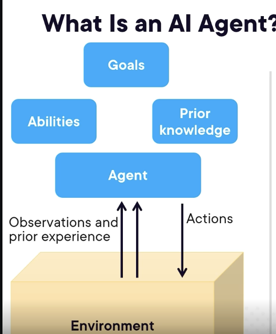
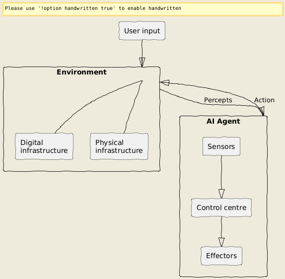

# Introduction to Developing AI Agents

---

- Fundamental concepts of AI Agents - Components and architecture
- Different types of AI Agents and their use cases: Simple reflex, Model-based, Goal-based, Learning, and Advanced AI agents
- Using LangGraph to create agentic system for shop hours inquiry
- Developing an agentic system with CrewAI for returns and refunds

---

# What is an AI Agent?

An agent is anything that can **perceive its environment** and **act upon that environment**.

According to ISO, an AI agent is an entity that **senses percepts** using sensors and **responds to its environment**.

--

---

## Core Components

- **Sensors**: Gather information from the environment.
- **Percepts**: Raw data inputs from sensors.
- **Environment**: The world the agent operates in (digital or physical).
- **Control Center**: The "brain" processing information, making decisions, and planning actions (often paired with an LLM).
- **Effectors**: The agent's "hands and feet," executing actions in the environment.
- **Action**: The changes made by effectors.

--

---

## Types of AI Agents

- Simple reflex agents
- Model-based reflex agents
- Goal-based agents
- Learning agents
- Advanced AI agents

---

# Types of AI Agents: Simple Reflex

- **Definition**: Make decisions based only on **current percepts**, ignoring history.
- **Environment**: Work only in **fully observable environments**.
- **Mechanism**: Follow **Condition-action rules**.
- **Problems**:
    - Limited intelligence.
    - No knowledge of non-perceptual state aspects.
    - Often too large to generate/store rules.
    - Not adaptive to environmental changes.
- **Examples**:
    - Basic spam filters (using keyword matching).
    - Automated email responders (based on specific triggers).

---

# Types of AI Agents: Model-based Reflex

- **Definition**: Work in **partially observable environments** and track situations. Keep track of parts of the environment not immediately visible.
- **Mechanism**: Make decisions based on **current inputs** and **past experiences**. Use their **internal model** to make decisions.
- **Key Factors**:
    - **Model**: Knowledge about how things happen in the world.
    - **Internal State**: Representation of the current state based on percept history (their memory).
- **Updating State Requires Knowing**:
    - How the world evolves over time.
    - How their actions impact the world.
- **Examples**:
    - Smart thermostats (optimize energy using historical data).
    - Smart robotic vacuums (use sensors and maps).

---

# Types of AI Agents: Goal-based

- **Requirement**: Knowing the current state isn't always enough; they need a **goal** defining a desirable situation.
- **Enhancement**: Expand on model-based agents by incorporating **goal information**.
- **Action Selection**: Choose actions that will lead them towards achieving their goal.
- **Process**: Evaluate action sequences through **searching and planning**, making them proactive.
- **Examples**:
    - Advanced chess AI engines (plan moves to maximize success probability).
    - Route optimization systems (plan optimal routes).

---

# Types of AI Agents: Learning

- **Definition**: Improves by **learning from past experiences**. Starts with basic knowledge and adapts.
- **Mechanism**: Analyze performance and continuously find ways to improve.
- **Four Main Components**:
    - **Learning element**: Responsible for making improvements by learning from the environment.
    - **Critic**: Provides feedback on performance compared to a standard.
    - **Performance element**: Responsible for selecting external actions.
    - **Problem generator**: Suggests actions that lead to new informative experiences.
- **Examples**:
    - Content recommendation systems (like Netflix/Amazon).
    - Adaptive thermostats (learn from habits).

---

# Advanced AI Agents

- **Core Mechanism**: Rely on **LLMs as their reasoning engine**. Use one or more language models to choose and execute a series of actions to achieve a specific goal.
- **Agentic**: Refers to the degree to which an AI system demonstrates agent-like qualities. Represents a **spectrum**.
    - Less agentic -> More agentic (Rule based, ML models, Adaptive AI, ... , Autonomous).
- **Key Capabilities/Design Patterns**:
    - **Reflection**: Analyze their own outputs to identify areas for improvement.
    - **Tool use**: Select and use tools to enhance abilities. Can interact with external systems like databases or APIs.
    - **Planning and reasoning**: Think ahead, weigh options, make logical decisions.
    - **Multi-agent collaboration**: Work with other agents to tackle complex problems.
    - **Memory management**: Store and recall important contexts from past interactions.
- **Frameworks**: LangGraph, CrewAI, OpenAI's Swarm, Microsoft's AutoGen, etc..

---

# Building with LangGraph: Shop Hours Inquiry

- **Use Case**: Carved Rock Fitness shoe company needs a self-service solution for shop hours inquiries.
- **Framework**: **LangGraph**, created by the same folks behind LangChain.
- **Workflow Modeling**: Models agent workflows as **graphs**.
- **Enables**: Building stateful multi-actor applications with LLMs. Designing both single agent and multi-agent workflows. Creating highly controllable agents.
- **Key Components**:
    - **State**: A **shared data structure** representing the application's current snapshot (e.g., messages list).
    - **Nodes**: Python functions that handle the agent's logic (e.g., processing input, making decisions, interacting with APIs).
    - **Edges**: Decide what happens next, choosing the next node based on the state (fixed transitions or conditional branches).

---

# Building with CrewAI: Returns and Refunds

- **Use Case**: Carved Rock Fitness needs a self-service solution for returns and refunds. Needs to analyze customer feedback sentiment.
- **Framework**: **CrewAI**, an open-source framework.
- **Concept**: Lets you create **AI crews** – a team of specialized AI agents working together to tackle complex tasks. Helps create an organization of agents with specialized roles.
- **Key Components**:
    - **Agent**: An **autonomous unit** that performs specific tasks and utilizes tools. Defined by role, goal, and backstory.
    - **Task**: A **particular assignment** that an agent completes. Defined by description and expected output. Can require teamwork.
    - **Crew**: A **team of agents** collaborating to complete tasks. Defines the strategy for execution, collaboration, and workflow.

---

### Reference
- [course](https://app.pluralsight.com/library/courses/introduction-developing-ai-agents/table-of-contents)  and [pluralsight course](https://app.pluralsight.com/library/courses/ai-powered-python-applications-using-agentic-frameworks/table-of-contents) 
- [example - calc, string ](https://github.com/vsingh9076/AI-Agents/tree/main/build-agent-from-scratch)
- [shopping assistant](https://github.com/locojk/Shopping-Assistant-with-LangGraph)
- [Crew AI examples](https://github.com/crewAIInc/crewAI-examples?tab=readme-ov-file)